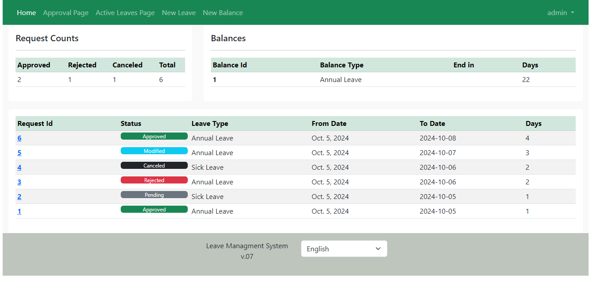
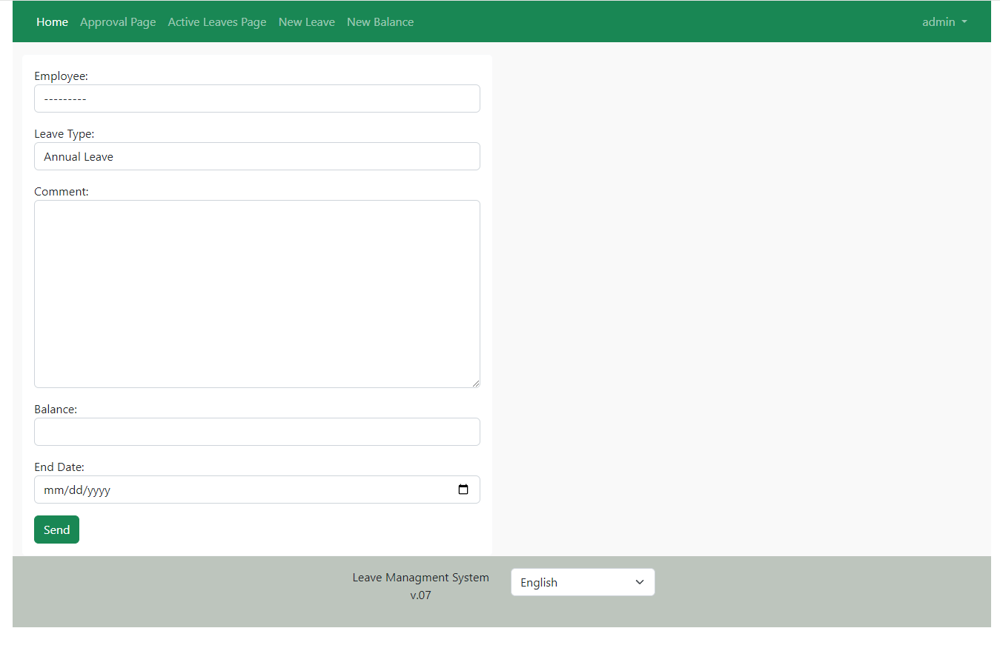
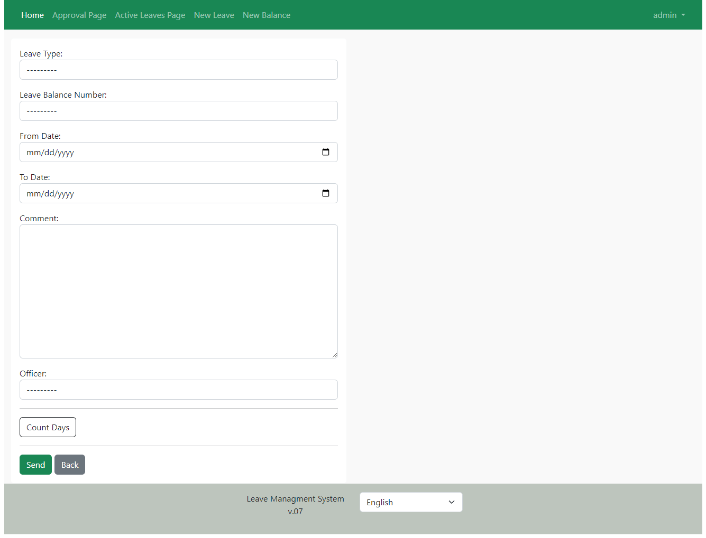
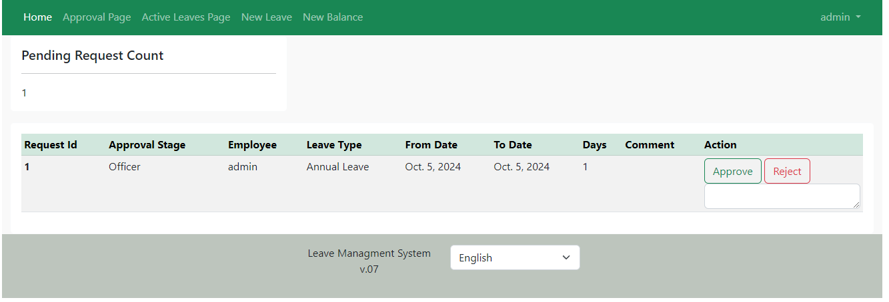
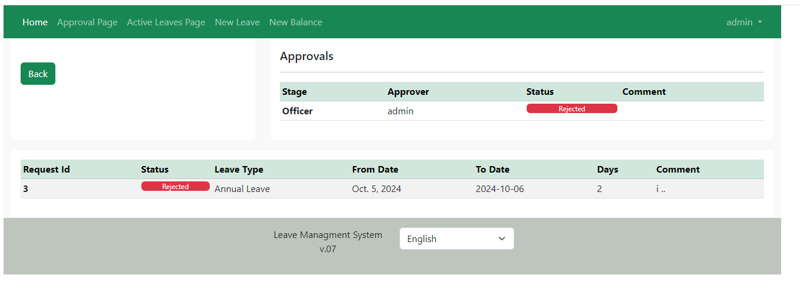

  

## Overview

The **Leave Management System** is a simple, user-friendly application designed to streamline the process of managing employee leave requests.

## Features

- **User Accounts**:
    Each employee has a unique account where they can log in, view their leave balance, and submit leave requests.

- **Leave Requests**:
    Employees can submit requests for different types of leave, such as Annual Leave, sick leave, directly through the system.

- **Approval Workflow**:
    Submitted leave requests are automatically forwarded to the respective personnel for approval or rejection.

- **Leave Balance Tracking**:
    The system keeps track of each employee's leave balance, updating it automatically as leave is approved and taken.

- **Email Notification**s:
    Automated email notifications keep users informed about the status of their leave requests.

## Usage
[Setup the application](./docs/Setup.md)

## Note
Check [docs](./docs/) for more info.
Use [Obisden md](https://obsidian.md/) for a better reading experience.

## Pics

